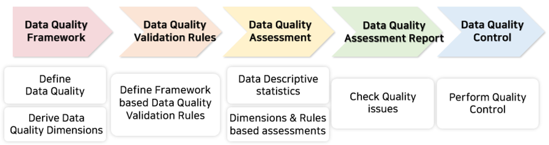

# DQproject
본 플랫폼은 보건의료 데이터의 품질 평가 및 관리를 위해 설게된 플랫폼
다양한 보건의료 데이터 레지스트리의 데이터 품질을 평가하고자 함.

## 데이터 품질 평가 절차
### 1. 데이터 품질 프레임워크 정의
### 2. 데이터 품질 검증 규칙 정의
### 3. 데이터 품질 평가 수행
### 4. 데이터 품질 평가 보고서 생성
### 5. 데이터 품질 관리 수행

## 1. 데이터 품질 프레임워크 정의

### (1) 데이터 품질 정의

### (2) 데이터 품질 평가 기준 정의

## 2. 데이터 품질 검증 규칙 정의

## 3. 데이터 품질 평가 수행

### (1) 데이터베이스 기술 통계 수행

### (2) 데이터 품질 검증 규칙 기반 품질 평가 수행

## 4. 데이터 품질 평가 보고서 생성
시각화 보고서 생성

## 5. 데이터 품질 관리 수행

